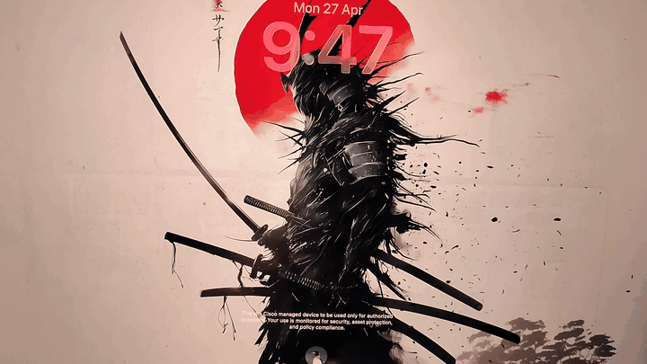

# LivePaper

**Live video wallpapers for macOS — desktop, lock screen, and screensaver.**

[](https://www.apple.com/macos/) [](https://swift.org) [](LICENSE) [](https://github.com/Raunik2/LivePaper)



> **Requires macOS Tahoe (16.0+).** Older versions (Sonoma, Sequoia) are not supported — the aerials format differs.

## Install

1. Open **Terminal** (press `⌘ Space`, type "Terminal", hit Enter)
2. Paste this and hit Enter:

```bash
curl -sL https://raw.githubusercontent.com/Raunik2/LivePaper/main/install.sh | bash
```

3. Chill — it builds and installs automatically. Done in ~60 seconds.

That's it. No Homebrew needed, no Gatekeeper warnings, works from any directory.

## Usage

LivePaper installs to `/Applications` like any regular app — open it from **Launchpad**, **Spotlight** (`⌘ Space` → type "LivePaper"), or directly from the **Applications** folder.

Once running, LivePaper lives in your **menu bar**. Click the icon to access controls:


From here you can open the dashboard, pause/resume the wallpaper, or quit the app.

## What You Get

- **Any video as your wallpaper** — MP4, MOV, M4V with seamless looping
- **Lock screen & screensaver** — your video plays natively on the lock screen
- **YouTube download** — paste a URL in the dashboard to import wallpapers
- **Mond clock overlay** — elegant clock widget on your desktop
- **Battery smart** — lowers quality on battery, optionally pauses completely
- **Multi-monitor** — works across all displays
- **Menu bar control** — play, pause, change video from the status bar

## Getting Wallpapers

### From YouTube

1. Search YouTube for: `live wallpaper for desktop`, `anime live wallpaper loop`, `4K nature live wallpaper`, or `aesthetic wallpaper engine`
2. Copy the video URL
3. Open the LivePaper dashboard (click the menu bar icon)
4. Paste the URL in the **Download from YouTube** section and hit Download
5. The video is automatically downloaded, converted, and set as your wallpaper

### From moewalls.com

Click **"Browse More Live Wallpapers"** in the dashboard — it opens [moewalls.com](https://moewalls.com) where you can download free animated wallpapers. Save the video, then drag it into the dashboard or put it in `~/Movies/LivePaper/`.

### Local files

Drop any `.mp4` / `.mov` / `.m4v` into `~/Movies/LivePaper/` — they show up in the Video Library automatically.

## CLI Control

```bash
echo "pause"   > /tmp/livepaper.pipe
echo "resume"  > /tmp/livepaper.pipe
echo "change /path/to/video.mp4" > /tmp/livepaper.pipe
echo "volume 50"  > /tmp/livepaper.pipe
echo "quit"       > /tmp/livepaper.pipe
```

## Build from Source

```bash
git clone https://github.com/Raunik2/LivePaper.git && cd LivePaper && bash build3.sh
```

## Why I Built This

Apple lets you pick from a handful of aerial videos for your lock screen — but only theirs. There's no built-in way to use your own video. Backdrop ($20, closed source) does it commercially. I couldn't find a single free, open-source alternative.

So I reverse-engineered Apple's `WallpaperAgent` and the JSON manifest at `~/Library/Application Support/com.apple.wallpaper/aerials/`. If you write a video into that manifest in the exact format macOS expects and restart the agent, the system treats it as if Apple shipped it.

LivePaper does that, plus a desktop wallpaper engine, a Mond-style clock overlay, battery-aware quality scaling, and YouTube import — all in 3K lines of Swift, no Xcode project, no dependencies.

## How It Works

| Layer | Detail |
|---|---|
| **Video Playback** | `AVQueuePlayer` + `AVPlayerLooper` with hardware-accelerated `AVPlayerLayer` at native Retina scale |
| **Desktop Level** | Wallpaper window at `desktopWindow + 1` — above real wallpaper, below everything else |
| **Aerials Injection** | Writes to `~/Library/Application Support/com.apple.wallpaper/aerials/` to register as a native aerial |
| **Lock Screen** | Elevates window above `CGShieldingWindowLevel` when screen locks |
| **Battery Mode** | Caps decode at 1080p + 5 Mbps on battery; optional full pause |
| **Occlusion Pause** | Stops decode when desktop is hidden by other windows |

## Troubleshooting

<details>
<summary><b>"swiftc: command not found"</b></summary>

The installer will prompt you to install Xcode Command Line Tools. Click **Install** in the dialog, wait ~5 minutes, then re-run the install command.
</details>

<details>
<summary><b>"App is damaged and can't be opened"</b></summary>

Run:
```bash
xattr -cr /Applications/LivePaper.app
open /Applications/LivePaper.app
```
The installer normally handles this, but if you moved the app or copied it from elsewhere, this resets the quarantine attribute.
</details>

<details>
<summary><b>Lock screen still shows Apple's default wallpaper</b></summary>

1. Open **System Settings → Wallpaper**
2. Scroll to the **Aerials** section — your video should appear there
3. Click it to set as wallpaper
4. If it doesn't appear, restart the wallpaper agent:
   ```bash
   killall WallpaperAgent
   ```
</details>

<details>
<summary><b>Video pauses unexpectedly on battery</b></summary>

This is intentional — battery mode caps quality. Open the dashboard → **Settings** → toggle **Pause on battery** off if you want full playback when unplugged.
</details>

<details>
<summary><b>"This requires macOS 16.0+"</b></summary>

LivePaper currently only works on macOS Tahoe. Earlier versions used a different aerials format that's not implemented. Contributions welcome.
</details>

## Contributing

Issues and PRs welcome. This is a hobby project that may break on macOS updates — if you spot a bug or want a feature, **[open an issue](https://github.com/Raunik2/LivePaper/issues)**.

Areas that need help:
- Sonoma / Sequoia support (different aerials format)
- Intel Mac builds
- Custom clock styles
- Localization

## Disclaimer

LivePaper modifies system folders that Apple does not officially document. **It may break on any macOS update.** Use at your own risk.

You're responsible for the content you use as wallpaper — please respect copyright. The YouTube import feature uses `yt-dlp`; obey YouTube's Terms of Service and the rights of the original creators.

This project is not affiliated with Apple Inc.

## ⭐ Star this repo

If LivePaper helped you, **[star the repo](https://github.com/Raunik2/LivePaper)** — it's the easiest way to support this project and helps others discover it.

## License

MIT — Copyright (c) 2026 [Raunak Gupta](https://linkedin.com/in/raunak5525/)
