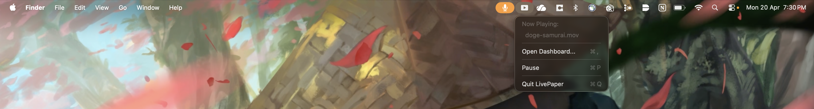

# LivePaper

**Live video wallpapers for macOS Tahoe.**

  

## Install

1. Open **Terminal** (press `⌘ Space`, type "Terminal", hit Enter)
2. Paste this and hit Enter:

```bash
curl -sL https://raw.githubusercontent.com/Raunik2/LivePaper/main/install.sh | bash
```

3. Chill — it builds and installs automatically. Done in ~60 seconds.

That's it. No Homebrew needed, no Gatekeeper warnings, works from any directory.

## Usage

LivePaper installs to `/Applications` like any regular app — open it from **Launchpad**, **Spotlight** (`⌘ Space` → type "LivePaper"), or directly from the **Applications** folder.

Once running, LivePaper lives in your **menu bar**. Click the icon to access controls:



From here you can open the dashboard, pause/resume the wallpaper, or quit the app.

## What You Get

- **Any video as your wallpaper** — MP4, MOV, M4V with seamless looping
- **Lock screen & screensaver** — your video plays natively on the lock screen
- **YouTube download** — paste a URL in the dashboard to import wallpapers
- **Mond clock overlay** — elegant clock widget on your desktop
- **Battery smart** — lowers quality on battery, optionally pauses completely
- **Multi-monitor** — works across all displays
- **Menu bar control** — play, pause, change video from the status bar

## Getting Wallpapers

### From YouTube

1. Search YouTube for: `live wallpaper for desktop`, `anime live wallpaper loop`, `4K nature live wallpaper`, or `aesthetic wallpaper engine`
2. Copy the video URL
3. Open the LivePaper dashboard (click the menu bar icon)
4. Paste the URL in the **Download from YouTube** section and hit Download
5. The video is automatically downloaded, converted, and set as your wallpaper

### From moewalls.com

Click **"Browse More Live Wallpapers"** in the dashboard — it opens [moewalls.com](https://moewalls.com) where you can download free animated wallpapers. Save the video, then drag it into the dashboard or put it in `~/Movies/LivePaper/`.

### Local files

Drop any `.mp4` / `.mov` / `.m4v` into `~/Movies/LivePaper/` — they show up in the Video Library automatically.

## CLI Control

```bash
echo "pause"   > /tmp/livepaper.pipe
echo "resume"  > /tmp/livepaper.pipe
echo "change /path/to/video.mp4" > /tmp/livepaper.pipe
echo "volume 50"  > /tmp/livepaper.pipe
echo "quit"       > /tmp/livepaper.pipe
```

## Build from Source

```bash
git clone https://github.com/Raunik2/LivePaper.git && cd LivePaper && bash build3.sh
```

## License

MIT — Copyright (c) 2026 Raunak Gupta
